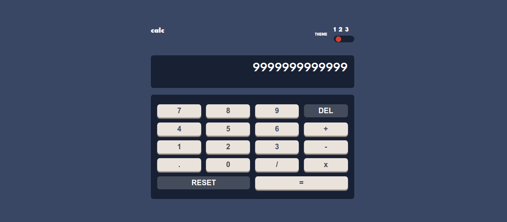
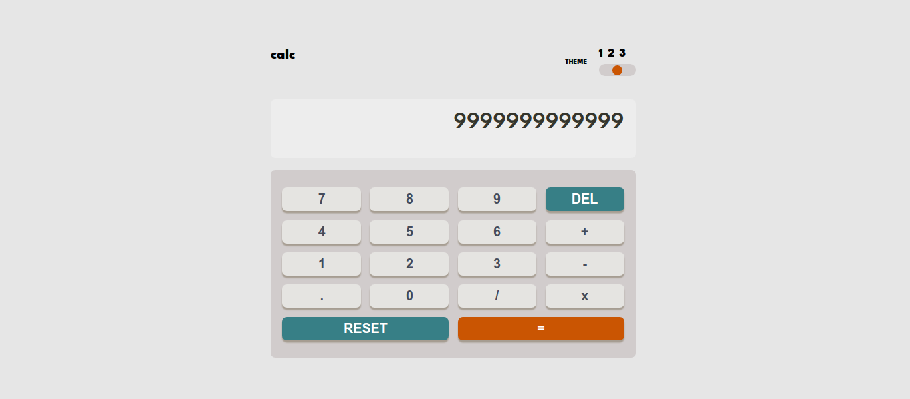
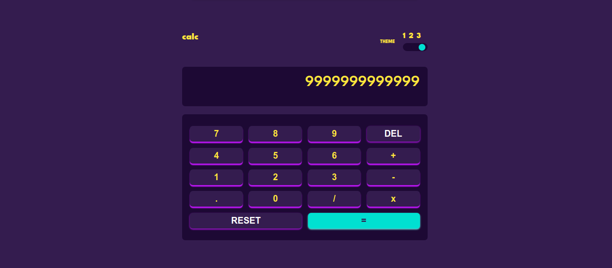
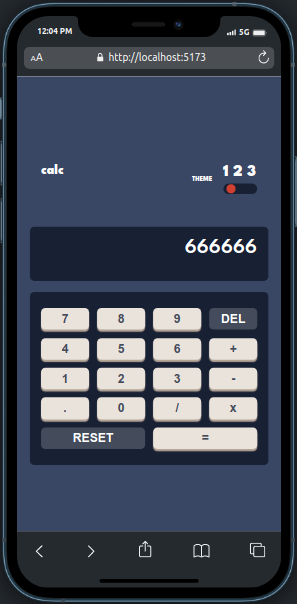
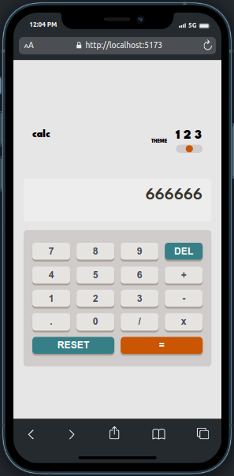
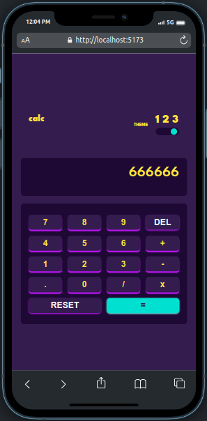

# Frontend Mentor - Calculator app solution
This is a solution to the [Calculator app challenge on Frontend Mentor](https://www.frontendmentor.io/challenges/calculator-app-9lteq5N29). Frontend 

## Table of contents

- [Overview](#overview)
  - [The challenge](#the-challenge)
  - [Screenshot](#screenshot)
  - [Links](#links)
- [My process](#my-process)
  - [Built with](#built-with)
  - [What I learned](#what-i-learned)
  - [Continued development](#continued-development)
  - [Useful resources](#useful-resources)
- [Author](#author)
- [Acknowledgments](#acknowledgments)


## Overview

### The challenge

Users should be able to:

- See the size of the elements adjust based on their device's screen size
- Perform mathmatical operations like addition, subtraction, multiplication, and division
- Adjust the color theme based on their preference
- **Bonus**: Have their initial theme preference checked using `prefers-color-scheme` and have any additional changes saved in the browser

### Screenshot










### Links

- Solution URL: https://www.frontendmentor.io/solutions/calculator-app-30PTn3AfAx
- Live Site URL: https://installable-calculator.netlify.app/

## My process

### Built with

- [React](https://reactjs.org/) - JS library
- Semantic HTML5 markup
- CSS custom properties
- Flexbox
- CSS Grid


### What I learned


I learnt how to implement three themes in an application which is was my first time of trying that 


```css
:root {
  /* Theme One */
  /* Backgorunds */
  --T1-main-background: hsl(222, 26%, 31%);
  --T1-toggle-background-keypad-background: hsl(223, 31%, 20%);
  --T1-screen-background: hsl(224, 36%, 15%);
  /* Keys */
  --T1-key-background: hsl(225, 21%, 49%);
  --T1-key-shadow: hsl(224, 28%, 35%);

  --T1-Red-key-background-toggle: hsl(6, 63%, 50%);
  --Dark-red-key-shadow: hsl(6, 70%, 34%);

  --T1-key-background: hsl(30, 25%, 89%);
  --T1-key-shadow: hsl(28, 16%, 65%);
  /* Text */
  --T1-Very-dark-grayish-blue: hsl(221, 14%, 31%);
  --T1-White: hsl(0, 0, 100%);
  /* Theme two */

  /* #### Backgrounds */

  --T2-main-background: hsl(0, 0%, 90%);
  --T2-toggle-background-keypad-background: hsl(0, 5%, 81%);
  --T2-screen-background: hsl(0, 0%, 93%);

  /*  Keys */

  --T2-key-background: hsl(185, 42%, 37%);
  --T2-key-shadow: hsl(185, 58%, 25%);

  --T2-key-background-toggle: hsl(25, 98%, 40%);
  --T2-key-shadow: hsl(25, 99%, 27%);

  --T2-key-background-: hsl(45, 7%, 89%);
  --T2-key-shadow: hsl(35, 11%, 61%);

  /* #### Text */

  --T2-Very-dark-grayish-yellow: hsl(60, 10%, 19%);
  --T2-White-text: hsl(0, 0, 100%);
  /* Theme Three */

  /* #### Backgrounds */

  --T3-main-background: hsl(268, 75%, 9%);
  --T3-toggle-keypad-screen-background: hsl(268, 71%, 12%);

  /* #### Keys */
  --T3-key-background: hsl(281, 89%, 26%);
  --T3-key-shadow: hsl(285, 91%, 52%);

  --T3-key-background-toggle: hsl(176, 100%, 44%);
  --T3-equalkey-shadow: hsl(177, 92%, 70%);

  --T3-key-background: hsl(268, 47%, 21%);
  --T3-Dark-magenta-key-shadow: hsl(290, 70%, 36%);

  /* #### Text */

  --T3-Light-yellow: hsl(52, 100%, 62%);
  --T3-Very-dark-blue: hsl(198, 20%, 13%);
  --T3-White-text: hsl(0, 0, 100%);
}

```
I learnt how to use the useRef hook 

```js
export default function CalcualtorFunc(btn, refScreen) {
  if (btn.innerText === "RESET") {
    refScreen.current.innerText = "";
  } else if (btn.innerText === "=") {
    try {
      let checker = refScreen.current.innerText.split("");
      if (checker.includes("x")) {
        let placeholder = "";
        const modifiedArray = checker.map((key) => {
          if (key == "x") {
            key = "*";
          } else {
            key = key;
          }
          return (placeholder += key);
        });

        refScreen.current.innerText = eval(placeholder);
      } else if (refScreen.current.innerText.startsWith("0")) {
        let placeholder = "";
        const modifiedArray = Array.from(refScreen.current.innerText);
        modifiedArray.shift();
        modifiedArray.map((key) => {
          return (placeholder += key);
        });

        refScreen.current.innerText = eval(placeholder);
      }
      refScreen.current.innerText = eval(refScreen.current.innerText);
    } catch (error) {
      refScreen.current.innerText = "Syntax Error";
    }
  } else if (btn.innerText === "DEL") {
    const newEls = Array.from(refScreen.current.innerText);
    if (refScreen.current.innerText === "Syntax Error") {
      refScreen.current.innerText = " ";
    } else if (
      refScreen.current.innerText === "Infinity" ||
      refScreen.current.innerText === "-Infinity" ||
      refScreen.current.innerText === "undefined"
    ) {
      refScreen.current.innerText = " ";
    } else {
      refScreen.current.innerText = String(
        newEls.splice(0, newEls.length - 1).join("")
      );
    }
  } else {
    if (refScreen.current.innerText === "Syntax Error") {
      refScreen.current.innerText = btn.innerText;
    }
    refScreen.current.innerText += btn.innerText;
  }
}

}
```


### Continued development
1.ACCESIBILITY
2.COMPLETE RESPONSIVENESS
3.PERFORMANCE ENHANCEMENT
4.PWA


## Author

- Website - (https://installable-calculator.netlify.app/)
- Frontend Mentor -(https://www.frontendmentor.io/profile/isaac-svg)


## Acknowledgments
MDN - (https://developer.mozilla.org/en-US/)
